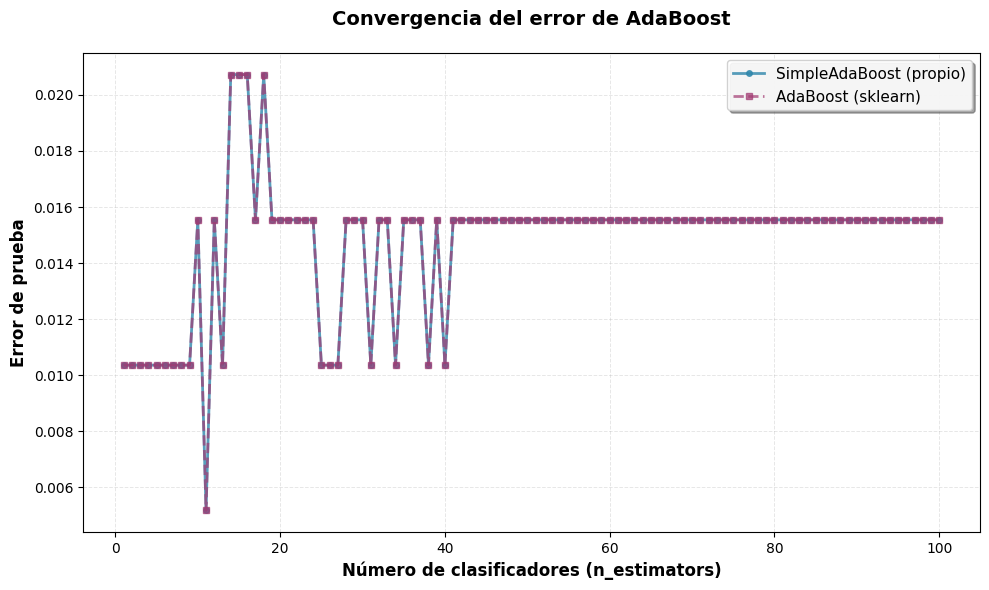
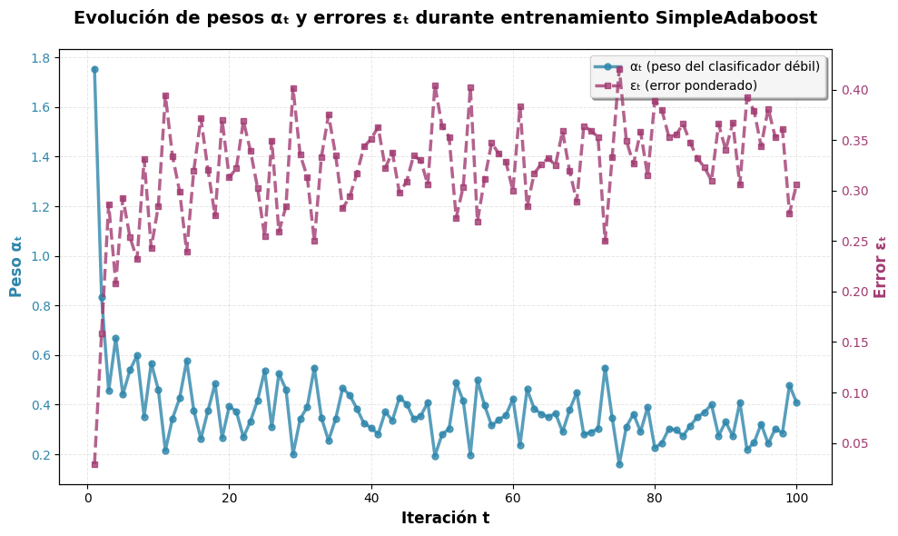

# 🚢 Titanic Survival Prediction with AdaBoost

<div align="center">


**Proyecto de Machine Learning Completo: Del Algoritmo a la Producción**

Ver Demo • Instalación • Características • Documentación

</div>

---

## 📋 Descripción del Proyecto

Predicción de supervivencia del Titanic implementando **AdaBoost desde cero** y desplegándolo como una **API REST containerizada con Docker**.

### 🎯 Objetivos Alcanzados

- ✅ **Implementación desde cero** de AdaBoost con validación teórica
- ✅ **Pipeline de preprocesamiento de datos**
- ✅ **API REST** con FastAPI
- ✅ **Containerización completa** con Docker y optimización multi-stage
- ✅ **Automatización** con Makefile para operaciones DevOps
- ✅ **Testing** automatizadas

---

## 🏗️ Arquitectura del Sistema

```
┌─────────────────────────────────────────────────────────────┐
│                     CLIENTE (Requests)                      │
└────────────────────────┬────────────────────────────────────┘
                         │
                         ▼
┌─────────────────────────────────────────────────────────────┐
│                   FastAPI REST API                          │
│  ┌──────────────┐  ┌──────────────┐  ┌──────────────┐       │
│  │   /health    │  │   /predict   │  │    /train    │       │
│  └──────────────┘  └──────────────┘  └──────────────┘       │
└────────────────────────┬────────────────────────────────────┘
                         │
                         ▼
┌─────────────────────────────────────────────────────────────┐
│              Pipeline de Preprocesamiento                   │
│  ┌──────────────────────────────────────────────────────┐   │
│  │ ExpectedColumns → Outliers → Imputation →            │   │
│  │ → Categorical Encoding → Scaling                     │   │
│  └──────────────────────────────────────────────────────┘   │
└────────────────────────┬────────────────────────────────────┘
                         │
                         ▼
┌─────────────────────────────────────────────────────────────┐
│                  Modelo AdaBoost Custom                     │
│  • 100 clasificadores débiles (DecisionTree depth=1)        │
│  • Accuracy: 98.45% | F1-Score: 97.67%                      │
└─────────────────────────────────────────────────────────────┘
```

---

## 🚀 Características Principales

### 🧮 **Implementación de AdaBoost Personalizada**

```python
class SimpleAdaBoost:
    def __init__(
      self, base_estimator=None,
      n_estimators=50,
      verbose=False,
      seed=0):
        ...

    def fit(self, X, y):
        maths...

    def predict(self, X, return_scores=False):
        maths...
```

**Resultados:**

| Métrica    | AdaBoost Custom | sklearn AdaBoost |
|------------|-----------------|------------------|
| Accuracy   | **98.45%**      | 98.96%           |
| Precision  | **98.44%**      | 98.67%           |
| Recall     | **96.92%**      | 98.67%           |
| F1-Score   | **97.67%**      | 98.67%           |

### 🔧 **Pipeline de Preprocesamiento**

```python
TitanicPipeline:
  ├── ExpectedColumns: Validación de schema
  ├── TitanicOutliersTransformer: 
  │   ├── Age: > 100 → NaN
  │   └── Fare: Capped at Q3 + 1.5*IQR
  ├── TitanicImputationTransformer:
  │   ├── Numéricas: Mediana
  │   └── Categóricas: Moda
  ├── TitanicCategoriesTransformer:
  │   └── OneHotEncoder (drop='first', handle_unknown='error')
  └── TitanicScalingTransformer:
      └── StandardScaler: (x - μ) / σ
```

### 🌐 **API REST con FastAPI**

#### Endpoints Disponibles

<details>
<summary><b>GET /health</b> - Health Check</summary>

```json
{
  "status": "ok"
}
```
</details>

<details>
<summary><b>GET /info</b> - Información del Modelo</summary>

```json
{
  "team": "macbuntu",
  "model": "AdaBoostClassifier",
  "base_estimator": "DecisionTreeClassifier(max_depth=1)",
  "n_estimators": 100,
  "preprocessing": {
    "pclass": "OneHot encoded (drop='first')",
    "age": "Outliers capped → Median imputation → StandardScaler",
    "fare": "Q3+1.5*IQR cap → Median imputation → StandardScaler",
    ...
  }
}
```
</details>

<details>
<summary><b>POST /predict</b> - Predicción de Supervivencia</summary>

**Request:**
```json
{
  "features": {
    "pclass": 1,
    "sex": "female",
    "age": 35,
    "sibsp": 0,
    "parch": 0,
    "fare": 80,
    "embarked": "C"
  }
}
```

**Response:**
```json
{
  "prediction": 1
}
```
</details>

<details>
<summary><b>GET /train</b> - Reentrenamiento del Modelo</summary>

```json
{
  "status": "success",
  "message": "Model trained successfully",
  "training_samples": 641,
  "elapsed_time_seconds": 2.34
}
```
</details>

### 🐳 **Containerización con Docker**

**Dockerfile Multi-Stage Optimizado:**

```dockerfile
# Stage 1: Builder (dependencias)
FROM python:3.11-slim AS builder
...
# Stage 2: Ejecution
FROM python:3.11-slim

ENV PYTHONDONTWRITEBYTECODE=1 \
    PYTHONUNBUFFERED=1

WORKDIR /app

COPY --from=builder /install /usr/local

COPY . .

EXPOSE 8000
CMD ["python", "main.py"]
```

**Beneficios:**
- ✨ Imagen final: **~350MB** (vs 1.2GB sin optimización)
- 🚀 Build time: **<2 min**


## 📦 Instalación

### Opción 1: Docker (Recomendado)

```bash
# Clonar repositorio
git clone https://github.com/Eickyair/macbuntu.git
cd macbuntu

# Construir y ejecutar con Make
make build
make run

# Verificar estado
make test

# Ver logs
docker logs adaboost-container-api
```

### Opción 2: Instalación Local

```bash
# Crear entorno virtual
python -m venv venv
source venv/bin/activate  # Linux/Mac
# o
venv\Scripts\activate     # Windows

# Instalar dependencias
pip install -r app/requirements.txt

# Ejecutar API
python main.py
```

---

## 🧪 Testing

### Pruebas Automatizadas

```bash
# Ejecutar tests completos
make test

# O manualmente
python test_requests.py
```

**Cobertura de Tests:**

| Test Case                        | Status |
|----------------------------------|--------|
| ✅ Health Check                  | PASS   |
| ✅ Info Endpoint                 | PASS   |
| ✅ Predicción válida             | PASS   |
| ✅ Manejo de campos faltantes    | PASS   |
| ✅ Validación de outliers        | PASS   |
| ✅ Entrenamiento del modelo      | PASS   |

---

## 📊 Análisis de Resultados

### Convergencia del Error



*error de prueba vs número de clasificadores*

### Evolución de Pesos α y Errores ε



*Análisis de la evolución de pesos αₜ y errores εₜ durante el entrenamiento*

### Métricas Clave

```
📈 Rendimiento del Modelo:
   • Accuracy:  98.45%
   • Precision: 98.44%
   • Recall:    96.92%
   • F1-Score:  97.67%

```

---

## 🛠️ Stack Tecnológico

<table>
<tr>
<td align="center" width="20%">
<br>
<b>Python 3.11</b><br>
Core Language
</td>
<td align="center" width="20%">
<br>
<b>FastAPI</b><br>
REST API
</td>
<td align="center" width="20%">
<br>
<b>scikit-learn</b><br>
ML Framework
</td>
<td align="center" width="20%">
<br>
<b>Docker</b><br>
Containerization
</td>
<td align="center" width="20%">
<br>
<b>Pandas</b><br>
Data Processing
</td>
</tr>
</table>

---

## 📚 Documentación Adicional

### Fundamentos Teóricos

<details>
<summary><b>¿Qué es AdaBoost?</b></summary>

AdaBoost (Adaptive Boosting) es un algoritmo de ensamble que combina clasificadores débiles mediante:

$$
F(x) = \sum_{t=1}^{T} \alpha_t h_t(x)
$$

Donde:
- $h_t(x)$: Clasificador débil en iteración $t$
- $\alpha_t = \frac{1}{2}\ln\left(\frac{1-\varepsilon_t}{\varepsilon_t}\right)$: Peso del clasificador
- $\varepsilon_t$: Error ponderado

**Actualización de pesos:**

$$
D_{t+1}(i) = \frac{D_t(i) \cdot e^{-\alpha_t y_i h_t(x_i)}}{Z_t}
$$

</details>

<details>
<summary><b>Preprocesamiento de Datos</b></summary>

**Pasos del Pipeline:**

1. **Validación de Columnas**: Asegura presencia de features requeridas
2. **Manejo de Outliers**:
   - Age: `> 100 → NaN`
   - Fare: `> Q3 + 1.5*IQR → Q3 + 1.5*IQR`
3. **Imputación**:
   - Numéricas: Mediana
   - Categóricas: Moda
4. **Encoding Categórico**: OneHotEncoder con `drop='first'`
5. **Escalado**: StandardScaler para features numéricas

</details>

### Comandos Make Disponibles

```bash
make build      # Construir imagen Docker
make run        # Ejecutar contenedor
make stop       # Detener contenedor
make clean      # Limpiar recursos
make test       # Ejecutar tests
make package    # Empaquetar proyecto
make status     # Ver estado del contenedor
```

---

## 🎓 Aprendizajes

### Hard Skills

- ✅ **Algoritmos de ML**: Implementación desde cero de AdaBoost
- ✅ **Preprocesamiento**: Pipelines con scikit-learn
- ✅ **API Development**: FastAPI con validación de datos
- ✅ **DevOps**: Docker, containerización multi-stage
- ✅ **Testing**: Suite de pruebas automatizadas
- ✅ **Python**: Programación orientada a objetos, type hints
- ✅ **Git**: Control de versiones, estructura de proyecto


## 👥 Equipo

**Team macbuntu**

<table>
<tr>
<td align="center">
<br>
<b>Erick</b><br>
<sub>ML Engineer</sub><br>
<a href="https://github.com/usuario1">GitHub</a>
</td>
<td align="center">
<br>
<b>Kike</b><br>
<sub>Datascience</sub><br>
<a href="https://github.com/1Enrique9">GitHub</a>
</td><td align="center">
<br>
<b>Luke</b><br>
<sub>Datascience</sub><br>
<a href="https://github.com/lukemorales13">GitHub</a>
</td>
<td align="center">
<br>
<b>Saul</b><br>
<sub>Datascience</sub><br>
<a href="https://github.com/SaulBibiano">GitHub</a>
</td>

</tr>
</table>

---

## 📄 Licencia

Este proyecto fue desarrollado como parte del Laboratorio de Machine Learning.

---

## 🔗 Enlaces Útiles

- 📘 [Documentación FastAPI](https://fastapi.tiangolo.com/)
- 📗 [scikit-learn AdaBoost](https://scikit-learn.org/stable/modules/ensemble.html#adaboost)
- 📙 [Docker Best Practices](https://docs.docker.com/develop/dev-best-practices/)


<div align="center">

**⭐ Si este proyecto te fue útil, considera darle una estrella ⭐**

[](https://github.com/Eickyair/macbuntu)

</div>